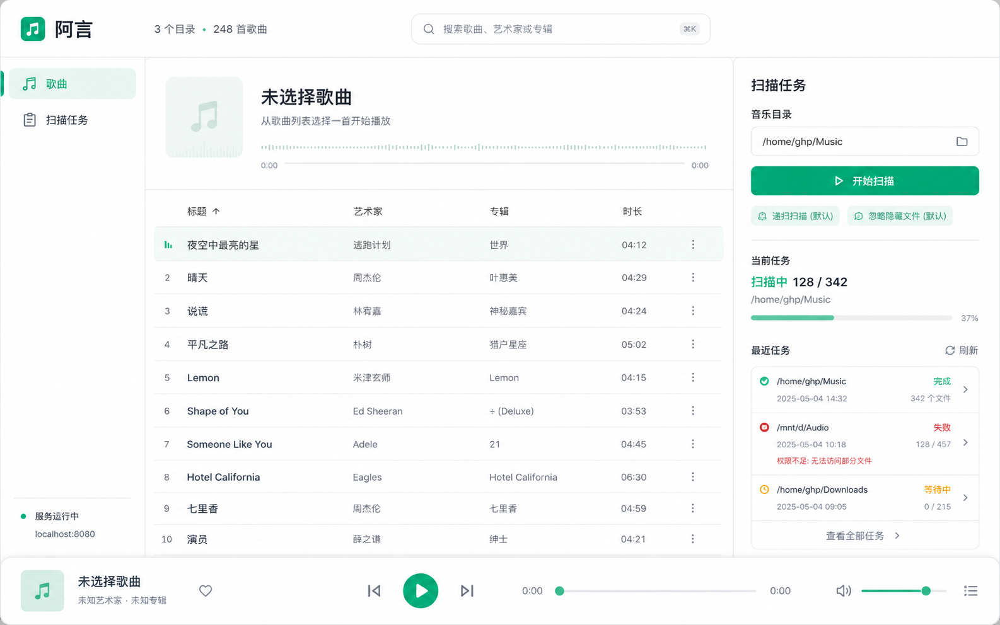

# 聆听早期 MVP 界面设计

这份文档记录早期 MVP 界面基线。v0.6 开始，页面方向转向成熟产品重构；新的页面方案应以 `v0.6-product-direction.md` 和后续 v0.6 页面设计文档为准。

## 产品名

聆听

## 视觉风格

MVP 采用现代清新的浅色界面，避免厚重桌面软件质感。

- 背景：暖白。
- 面板：浅灰、薄边框、轻阴影。
- 主色：薄荷绿。
- 文本：深炭灰。
- 状态色：少量珊瑚和琥珀。
- 圆角：8px 或更小。
- 整体气质：干净、轻量、可长期使用。

不使用：

- 深色厚重木质或石墨质感。
- 紫色渐变。
- 装饰性光球或背景装饰。
- 营销页式大标题。
- 卡片套卡片。

## 页面布局

### 顶部

顶部用于全局信息和搜索：

- 品牌名：`聆听`
- 媒体库摘要，例如 `3 个目录 · 248 首歌曲`
- 搜索框

顶部不放播放控制按钮，避免和底部播放器重复。

### 左侧

左侧是极简导航：

- `歌曲`
- `扫描任务`

MVP 不保留设置入口。递归扫描和忽略隐藏文件是默认逻辑，不作为设置项出现。

### 中间

中间是主要播放器内容区：

- 当前播放摘要：
  - 未播放时显示 `未选择歌曲`
  - 辅助文案：`从歌曲列表选择一首开始播放`
  - 可展示轻量的被动进度线或状态线
  - 不放播放/暂停/上一首/下一首按钮

- 歌曲表格：
  - 标题
  - 艺术家
  - 专辑
  - 时长

选中行使用浅薄荷色高亮。MVP 不展示封面，避免制造第一版支持封面的预期。

### 右侧

右侧是扫描任务管理区，并常驻显示扫描表单：

- 标题：`扫描任务`
- 字段：`音乐目录`
- 输入示例：`/home/ghp/Music`
- 主按钮：`开始扫描`
- 只读默认标签：
  - `递归扫描`
  - `忽略隐藏文件`

下方展示扫描任务状态：

- 当前任务进度条。
- 当前任务路径。
- 最近任务列表。
- 每条任务包含目录路径、状态、时间、文件数量。
- 失败任务显示简短错误摘要。

最近任务表示不同目录、不同时间点的扫描记录。由于 MVP 支持多目录累加，扫描不同目录会合并进同一个媒体库。

### 底部

底部是唯一播放控制区，固定在页面底部：

- 当前歌曲标题和艺术家。
- 上一首。
- 播放/暂停。
- 下一首。
- 播放进度。
- 当前时间和总时长。
- 音量。

播放控制只出现在底部。其他区域只展示当前歌曲摘要，不重复控制按钮。

## 交互规则

- 扫描任务表单常驻显示，不使用“新建任务”按钮。
- 点击 `开始扫描` 后，右侧显示当前扫描进度。
- 前端轮询扫描任务接口，扫描完成后刷新歌曲列表和媒体库摘要。
- 重新扫描已存在目录时，只替换该目录下的歌曲。
- 扫描新目录时，将歌曲累加到媒体库。
- 用户点击歌曲表格行后，底部播放器更新并开始播放。
- 搜索框过滤歌曲列表，MVP 只做基础关键词搜索。

## 参考图

