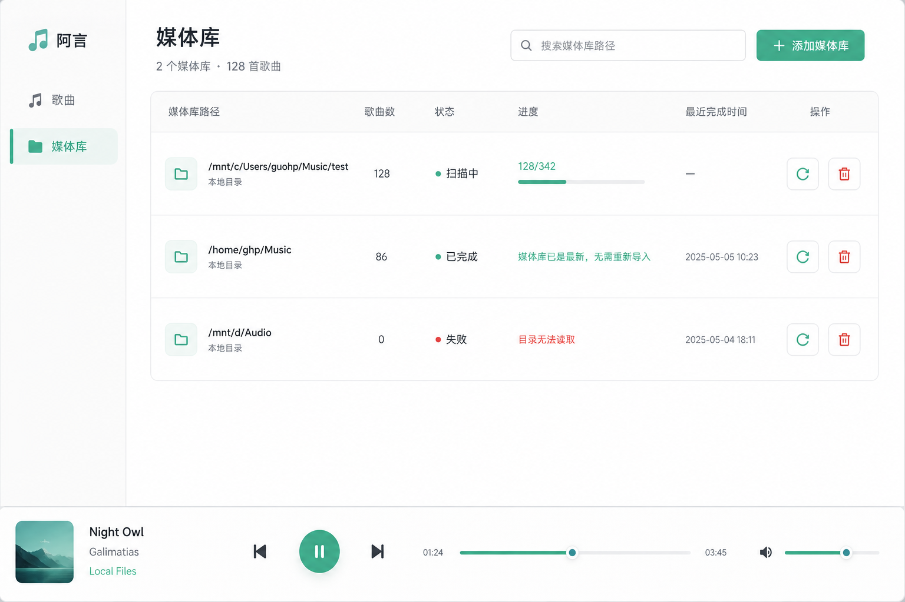
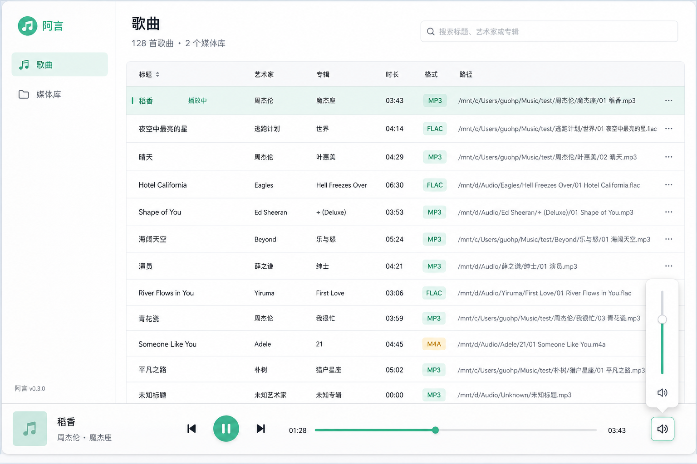

# 阿言 v0.3 UI 设计

v0.3 的界面结构从“歌曲页 + 右侧扫描面板”调整为“歌曲管理”和“媒体库管理”两个同级页面。扫描是媒体库上的动作，不再作为独立侧栏或右侧面板出现。

## 视觉风格

| 项目 | 设计要求 |
|---|---|
| 整体风格 | 现代、清新、克制 |
| 背景 | 暖白背景 |
| 面板 | 浅灰或白色面板，轻阴影 |
| 主色 | 薄荷绿 |
| 状态色 | 少量珊瑚红、琥珀黄 |
| 圆角 | 8px 为主 |

## 全局布局

| 区域 | 说明 |
|---|---|
| 左侧栏 | 品牌标识、`歌曲`、`媒体库` 两个入口 |
| 主内容区 | 随当前入口切换 |
| 底部播放器 | 全局常驻，只保留播放相关能力 |

侧边栏只保留：

```text
歌曲
媒体库
```

不做设置入口。

## 媒体库页



媒体库页用于管理本地音乐目录。

页面内容：

| 元素 | 行为 |
|---|---|
| 标题 | `媒体库` |
| 摘要 | 显示媒体库数量和歌曲数量 |
| 搜索 | 搜索媒体库路径 |
| 添加媒体库 | 输入目录并添加媒体库 |
| 媒体库列表 | 展示路径、歌曲数、扫描状态、进度、最近完成时间 |
| 扫描按钮 | 对该媒体库触发扫描或再次扫描 |
| 删除按钮 | 删除媒体库索引，不删除本地文件 |

扫描信息作为媒体库 item 的附属状态展示：

```text
扫描中 128/342
扫描完成
媒体库已是最新，无需重新导入
目录无法读取
```

## 歌曲页



歌曲页用于展示和播放当前所有媒体库引用到的音乐。

页面内容：

| 元素 | 行为 |
|---|---|
| 标题 | `歌曲` |
| 摘要 | 显示歌曲数量和媒体库数量 |
| 搜索 | 搜索标题、艺术家或专辑 |
| 歌曲表格 | 展示标题、艺术家、专辑、时长、格式、路径 |
| 当前行状态 | 当前歌曲显示播放中、暂停中或加载中 |

不在 v0.3 做额外筛选控件，例如：

```text
最近添加
时长未知
```

## 底部播放器

底部播放器全局常驻。

保留能力：

| 控件 | 说明 |
|---|---|
| 当前歌曲信息 | 靠左展示标题和艺术家 |
| 上一首 | 基于当前歌曲列表切换 |
| 播放 / 暂停 | 单一主按钮 |
| 下一首 | 基于当前歌曲列表切换 |
| 进度条 | 占用更长宽度，支持拖动 |
| 音量 | 图标按钮，点击后弹出竖向滑杆 |

明确不做：

```text
收藏
播放队列
歌词
封面墙
设置
```

## 排除项

v0.3 UI 不包含：

| 功能 | 原因 |
|---|---|
| 右侧扫描面板 | 扫描从媒体库 item 触发 |
| 扫描任务独立页面 | 扫描任务是媒体库附属状态 |
| 收藏 | 当前没有收藏数据模型 |
| 播放队列 | 当前没有队列数据模型 |
| 歌词 | 超出 v0.3 范围 |
| 设置页 | 当前配置仍保持最小实现 |
| 歌曲筛选控件 | 未对齐为 v0.3 功能 |

