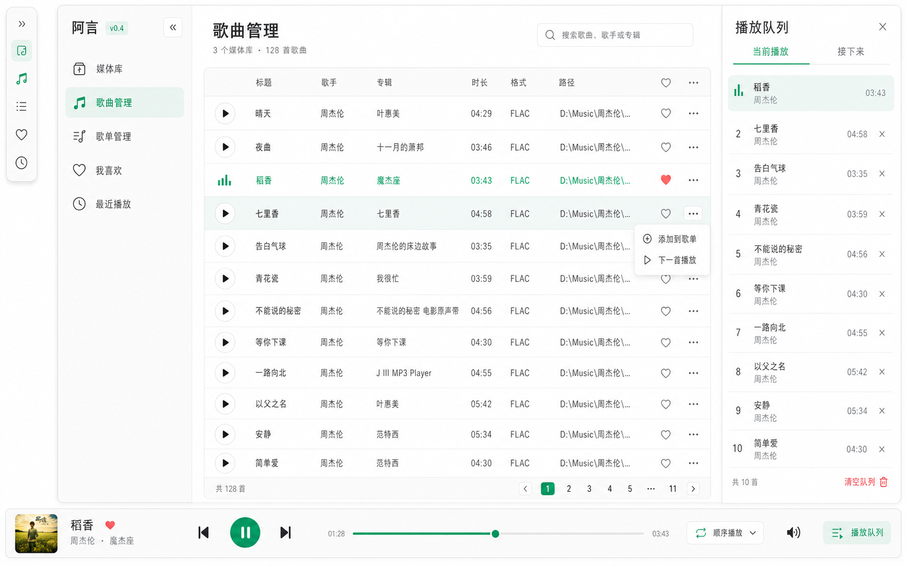

# 阿言 v0.4 UI 设计

v0.4 的 UI 重点是围绕基础播放器能力重组导航、歌曲列表和底部播放器，让歌单、队列、播放顺序成为可见且可操作的核心能力。

## 视觉稿



## 视觉风格

| 项目 | 设计要求 |
|---|---|
| 整体风格 | 现代、清新、克制 |
| 背景 | 暖白背景 |
| 面板 | 浅灰或白色面板 |
| 主色 | 薄荷绿 |
| 状态色 | 少量珊瑚红、琥珀黄 |
| 圆角 | 以 8px 为主 |

## 侧边栏

侧边栏固定顺序：

```text
媒体库
歌曲管理
歌单管理
我喜欢
最近播放
```

规则：

| 状态 | 行为 |
|---|---|
| 展开 | 图标和文本横向并排展示 |
| 收起 | 只展示图标，不展示文本 |
| 收起按钮 | 放在品牌区附近 |
| 收起态辅助 | 每个图标保留 `title` 或 tooltip |
| 布局适配 | 主内容区和底部播放器随侧栏宽度变化，不半压侧栏 |

`我喜欢` 和 `最近播放` 虽然是系统歌单，但在侧边栏作为独立入口展示，不出现在歌单管理页的普通歌单列表中。

## 页面结构

| 页面 | 说明 |
|---|---|
| 媒体库 | 添加、扫描、再次扫描、删除媒体库 |
| 歌曲管理 | 展示全部歌曲、搜索、播放、收藏、添加到歌单、下一首播放 |
| 歌单管理 | 只管理普通歌单，支持创建、重命名、删除、查看歌单内歌曲 |
| 我喜欢 | 展示收藏歌曲，不提供重命名和删除入口 |
| 最近播放 | 展示最近播放歌曲，不提供重命名、删除、手动添加和清空入口 |

## 歌曲列表

歌曲列表用于以下页面：

```text
歌曲管理
普通歌单详情
我喜欢
最近播放
```

所有歌曲列表保持一致交互：

| 元素 | 行为 |
|---|---|
| 播放按钮 | 播放该歌曲，并插入播放队列队首 |
| 歌曲行单击 | 只选中，不播放 |
| 歌曲行双击 | 播放该歌曲，并插入播放队列队首 |
| 收藏按钮 | 加入或移出 `我喜欢` |
| 三点菜单 | `添加到歌单`、`下一首播放` |

表格建议列：

```text
播放
标题
艺术家
专辑
时长
格式
路径
收藏
更多
```

## 播放队列抽屉

播放队列从右侧抽屉打开。

| 区域 | 说明 |
|---|---|
| 当前播放 | 展示当前歌曲 |
| 接下来 | 展示后续队列 |
| 移除按钮 | 支持移除未播放歌曲 |

队列抽屉由底部播放器最右侧的队列按钮打开。抽屉打开时，队列按钮显示 active 状态。

## 底部播放器

底部播放器全局常驻，并与主内容区对齐，不覆盖侧边栏。

布局规则：

| 区域 | 说明 |
|---|---|
| 左侧 | 当前歌曲信息 |
| 控制按钮 | 上一首、播放/暂停、下一首，整体靠左，不居中堆在页面中间 |
| 中间 | 长进度条和时间 |
| 进度条右侧 | 播放顺序按钮，显示顺序播放、列表循环或随机播放 |
| 右侧 | 音量按钮和播放队列按钮处在同一水平线 |
| 最右侧 | 播放队列按钮 |

明确不做：

```text
底部更多菜单
底部三点按钮
底部收藏入口
歌词入口
均衡器入口
```

音量可以点击后弹出竖向滑杆，但音量按钮本身必须与其他播放器组件处在同一水平线上。

